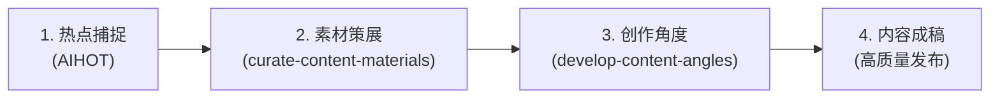

# AI POSTer 内容二创工作流

一套面向 AI 创作者的高质量内容生产与二创工作流。从「热点雷达」到「素材策展」，再到「独特创作角度」，解决选题同质化、内容像摘要、观点生硬等痛点，帮助创作者建立具备个人风格的内容体系。

---

## 🛠️ 工作流全景架构



| 阶段 | 核心模块 / Skill | 职责说明 | 解决的痛点 |
| :--- | :--- | :--- | :--- |
| **01. 热点捕捉** | [AIHOT](https://aihot.virxact.com/aihot-skill/README.md) | 聚合多平台热榜与趋势信息，作为线索雷达 | 信息孤岛、追热点不及时 |
| **02. 筛选素材** | [curate-content-materials](../aipost/curate-content-materials) | 宽进窄出，从真实反应识别认知/立场/情绪/叙事缺口 | 选题偏技术、不知写什么、素材过载 |
| **03. 创作角度** | [develop-content-angles](../aipost/develop-content-angles) | 寻找张力空白，从近景/场景/远景提炼独特二创切入点 | 内容像摘要、换汤不换药、缺少个人视角 |

---

## 📦 技能安装指南 (Installation)

根据你使用的 AI Agent / IDE 工具，选择对应的安装方式：

### 1. 本地项目安装（推荐）

将本工作流技能复制到当前项目的技能目录（如 `.agents/skills/`）：

```bash
# 1. 进入技能项目目录并创建技能目录（如果尚未创建）
mkdir -p .agents/skills

# 2. 将 aipost 内的技能复制到项目的技能目录中
cp -r aipost/curate-content-materials .agents/skills/
cp -r aipost/develop-content-angles .agents/skills/
```

### 2. 全局安装（跨项目复用）

将技能放置到全局配置目录，即可在所有项目中直接调用：
- **Antigravity**: `~/.gemini/config/skills/`
- **Claude Code**: `~/.claude/skills/`

```bash
# 以 Antigravity 全局安装为例：
mkdir -p ~/.gemini/config/skills
cp -r aipost/curate-content-materials ~/.gemini/config/skills/
cp -r aipost/develop-content-angles ~/.gemini/config/skills/
```

---

## 🧩 核心模块详解与配置

### 步骤一：安装热点雷达（AIHOT）
- **官方文档与安装指南**：[AIHOT Skill 安装说明](https://aihot.virxact.com/aihot-skill/README.md)
- **作用**：提供多平台实时热点资讯检索接口，作为整个工作流的信息源输入。

### 步骤二：素材策展技能（curate-content-materials）
- **路径**：[`./curate-content-materials`](../aipost/curate-content-materials)
- **核心能力**：
  - **宽进窄出原则**：降低收集门槛，提高发布门槛。
  - **三句话测试**：
    > 1. 它最先触动我的是：________  
    > 2. 大多数人可能只看到：________  
    > 3. 我想把其中这一层留下来：________
  - **素材分流机制**：根据成熟度分流至「深度内容」、「短内容」、「合集趋势」或「素材池沉淀」。

### 步骤三：二创角度构思技能（develop-content-angles）
- **路径**：[`./develop-content-angles`](../aipost/develop-content-angles)
- **核心能力**：
  - **二创公式**：`二创角度 = 素材张力/空白 × 创作者进入位置 × 读者获得的新东西`
  - **三种观察距离**：
    - **近景**：停留在素材内部，纠正误解/还原取舍
    - **场景**：放进具体人的工作/生活处境
    - **远景**：建立更大的社会、趋势或文化连接
  - **内容弧线**：`具体细节 -> 隐藏一层 -> 回到人的处境`

---

## 🚀 快速上手示例 (Quick Start)

安装完成后，你可以直接在 Agent 对话中通过以下提示词触发相应流程：

### 场景 1：从热点中筛选可用素材
> **Prompt**：  
> “请使用 `curate-content-materials` 技能，帮我筛选以下这几条热点/素材列表，输出素材筛选表，并给出每条素材的建议去向与选题方向。”

### 场景 2：为选定素材构思二创角度
> **Prompt**：  
> “我已经选定了这条关于 [某个新工具/新热点] 的素材。请使用 `develop-content-angles` 技能，为我生成近景、场景、远景三个维度的二创角度卡，并推荐最佳主角度及理由。”

### 场景 3：文稿去套路化与诊断
> **Prompt**：  
> “这是我写的一篇二创草稿，感觉像在做信息摘要。请使用 `develop-content-angles` 帮我做原稿诊断，找出停留在转述的地方并重构角度与内容骨架。”

---

## 💡 创作原则与避坑指南

1. **避免技术偏置**：不要默认所有素材都需要从技术原理展开，允许从情绪、画面、立场和具体选择切入。
2. **拒绝机械反常识**：不要为了“有观点”而强行制造反直觉标题，张力必须来自真实经验或可靠事实。
3. **先有反应，再找角度**：如果素材无法引发真实的惊讶、怀疑、认同或共鸣，优先暂存或放弃，切忌强行制造态度。