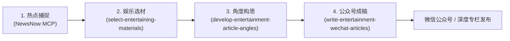

# 娱乐er · 娱乐内容二创与公众号工作流

一套专为娱乐、情感、社会热点与轻生活题材打造的 **AI 娱乐内容创作工作流**。从「全网热榜感知（MCP）」到「娱乐素材精选」，再到「多维角度构思」与「深度公众号长文」，帮助创作者告别低俗营销腔、新闻流水账与模板套话，写出**有反差、有场景、克制自然、留有余味**的爆款内容。

---

## 🛠️ 工作流全景架构



| 阶段 | 核心模块 / 技能 | 职责定位 | 解决的痛点 |
| :--- | :--- | :--- | :--- |
| **01. 热点捕捉** | [NewsNow MCP](#步骤一配置热点雷达-newsnow-mcp) | 聚合全网多平台热搜与资讯动态 | 追热点慢、信息源分散 |
| **02. 娱乐筛选** | [select-entertaining-materials](../entertainpost/select-entertaining-materials) | 娱乐优先选材，设好奇心硬门槛，提炼人的抓手与二创余量 | 素材太技术、纯低俗刺激、缺少故事性 |
| **03. 角度构思** | [develop-entertainment-article-angles](../entertainpost/develop-entertainment-article-angles) | 寻找张力空白，从认知路径或轻分享提炼独特切入点 | 内容像摘要、换汤不换药、笑点被过度解释 |
| **04. 公众号文笔** | [write-entertainment-wechat-articles](../entertainpost/write-entertainment-wechat-articles) | 七分冷静三分情绪，事实在前判断在后，支持单素材/主辅/素材簇 | 营销口播腔、案例拼盘、强行上价值、爹味说教 |

---

## 📦 安装与配置指南 (Setup & Installation)

### 步骤一：配置热点雷达 (NewsNow MCP)

在你的 Agent / IDE 环境的 MCP 配置文件（如 `mcp_config.json` 或 `claude_desktop_config.json`）中添加 `newsnow` 服务：

```json
{
  "mcpServers": {
    "newsnow": {
      "command": "npx",
      "args": [
        "-y",
        "newsnow-mcp-server"
      ],
      "env": {
        "BASE_URL": "https://newsnow.busiyi.world"
      },
      "disabled": false
    }
  }
}
```

> **说明**：配置生效后，Agent 可以直接调用该 MCP Server 实时拉取微博、抖音、知乎、B站、小红书等各大平台的最新热榜。

---

### 步骤二：安装工作流技能 (Skills)

#### 1. 本地项目安装（推荐）

将 `entertainpost` 目录下的技能复制到当前项目的技能目录（如 `.agents/skills/`）：

```bash
# 1. 创建项目的技能目录（如果尚未创建）
mkdir -p .agents/skills

# 2. 复制娱乐工作流的核心技能
cp -r entertainpost/select-entertaining-materials .agents/skills/
cp -r entertainpost/develop-entertainment-article-angles .agents/skills/
cp -r entertainpost/write-entertainment-wechat-articles .agents/skills/
```

#### 2. 全局安装（跨项目复用）

将技能放置到全局配置目录，即可在任意项目中随时调用：
- **Antigravity**: `~/.gemini/config/skills/`
- **Claude Code**: `~/.claude/skills/`

```bash
# 以 Antigravity 全局安装为例：
mkdir -p ~/.gemini/config/skills
cp -r entertainpost/select-entertaining-materials ~/.gemini/config/skills/
cp -r entertainpost/develop-entertainment-article-angles ~/.gemini/config/skills/
cp -r entertainpost/write-entertainment-wechat-articles ~/.gemini/config/skills/
```

---

## 🧩 核心模块详解

### 1. 娱乐素材精选：[`select-entertaining-materials`](../entertainpost/select-entertaining-materials)
- **选材核心公式**：`注意力入口 × 具体事件 × 人物选择 × 意外结果 × 二创余量`
- **8 大注意力入口**：情感与关系、八卦与窥私、明星与身份反差、金钱与地位、性吸引与边界、奇闻与猎奇、争议与裁决、自我认领。
- **好奇心硬门槛**：去掉夸张标题后，一句话转述是否能让人追问“然后呢 / 凭什么 / 换成我会怎样”。
- **标准化交付字段**：素材事实、注意力入口、人的抓手、核心反差、预期反应、个人观察、风险标记。

### 2. 娱乐文章角度构思：[`develop-entertainment-article-angles`](../entertainpost/develop-entertainment-article-angles)
- **组织方式判断**：智能决策单素材深度故事、一主两辅对照、或共同机制素材簇。
- **角度提炼维度**：从人物欲望、关系分歧、身份反差、利益结构、流量边界与后续代价中寻找核心张力。
- **输出标准化骨架**：提炼唯一主角度，生成可无缝交付给写作技能的清晰文章骨架与节点推进逻辑。

### 3. 公众号深度文笔：[`write-entertainment-wechat-articles`](../entertainpost/write-entertainment-wechat-articles)
- **文风基调**：七分冷静，三分情绪。用具体事实和动作制造张力，不用感叹号替素材喊叫。
- **强开头法则**：前三段完成“交付异常事实 ➔ 补足最低背景 ➔ 指出核心矛盾”。
- **叙事推进**：`人物想得到什么 ➔ 做了什么选择 ➔ 事情如何偏离 ➔ 谁承担结果`。
- **三种素材组织模式**：单素材故事（1200~1800字）、一主两辅（1600~2400字）、素材簇共同机制（1800~2800字）。

---

## 🚀 快速上手实战示例 (Quick Start)

### 场景 1：用 MCP 获取热点并进行娱乐选材
> **Prompt**：  
> “请调用 `newsnow` 工具获取今天微博和知乎的热榜，然后使用 `select-entertaining-materials` 技能，帮我筛选出最值得二创的 3 条娱乐/生活/反差素材，并输出人的抓手与二创余量。”

### 场景 2：为选定娱乐素材构思切入角度
> **Prompt**：  
> “针对这条 [某明星回应/反差奇闻] 素材，使用 `develop-entertainment-article-angles` 技能，为我分析认知路径与轻分享路径的切入点，提炼核心张力与主角度。”

### 场景 3：写一篇克制深刻的公众号娱乐长文
> **Prompt**：  
> “这是关于 [某事件/婚姻争议/财富反差] 的事实材料与主角度。请使用 `write-entertainment-wechat-articles` 技能，采用『单素材』模式写一篇 1500 字左右的公众号成稿，要求开头抓人、事实在前判断在后、结尾自然定格。”

### 场景 4：文稿去油与诊断
> **Prompt**：  
> “这是我写的一篇娱乐公众号草稿，感觉通篇在喊口号、营销感太重。请使用 `write-entertainment-wechat-articles` 进行三轮修订诊断，删除情绪煽动词和爹味总结，重构出一篇冷静克制的成稿。”

---

## 💡 创作伦理与风格护栏

1. **拒绝窥私与低俗**：不使用私人信息、病历、偷拍或严重人身攻击；擦边内容只在有人设/规则/利益冲突时切入，不放大纯身体描写。
2. **拒绝制造对立**：不为了流量强行制造男女对立或非黑即白的阵营冲突，把问题还原为具体的人、选择与代价。
3. **不做道德审判官**：区分行为后果与人格评价，不替当事人诊断心理，不扮演人生导师。
4. **事实在前，判断在后**：每一次分析都从具体动作长出来，只比素材多走一步，绝不强行上升到时代与宏大叙事。